Create environment using environment.yml.

Details to run are provided with each experiment.

In order to understand the principle behind paper, please start with static subset alignment between toy point distributions start with this [notebook](static_subsetting_toy.ipynb).
| Static example c=2 | Dynamic example c=2 |
|:--------------:|:---------------:|
| 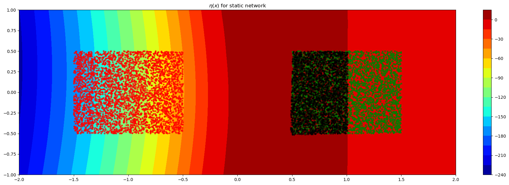 | 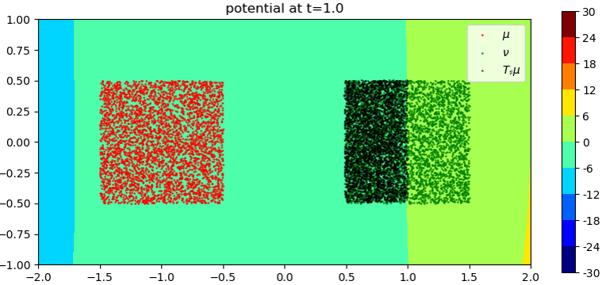 |
Evolution of dynamic potential with time
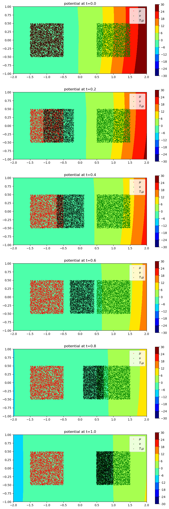
MNIST $\rightarrow$ EMNIST

| Static | Dynamic |
|:--------------:|:---------------:|
| 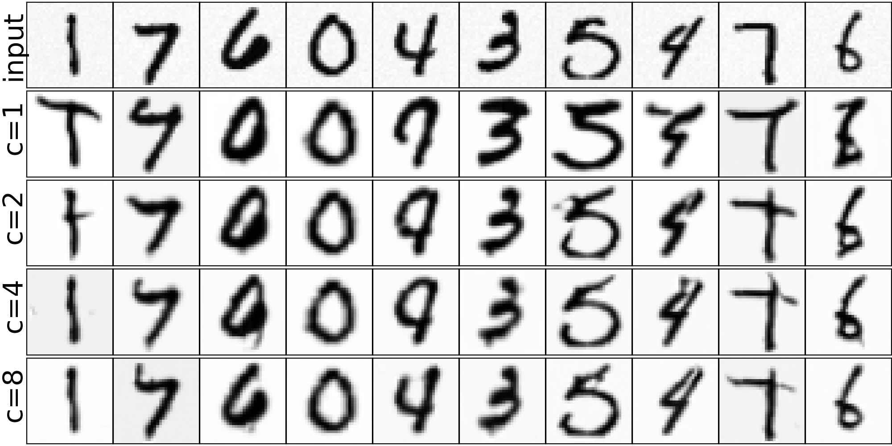 | 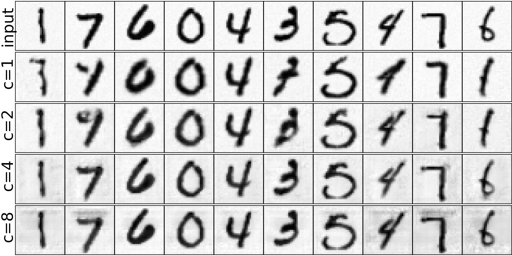 |

## FFHQ: Results

### Old → Young

| (a) Static subset | (b) Dynamic subset (Euler 100 steps) |
|:--:|:--:|
| 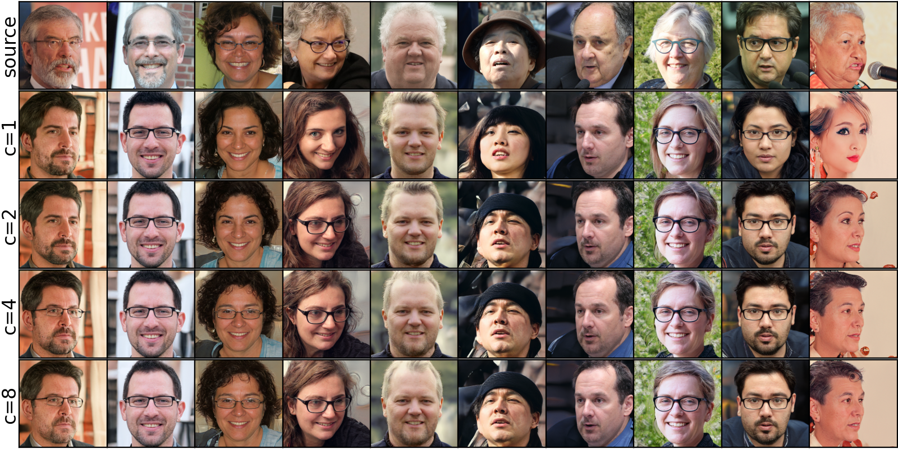 | 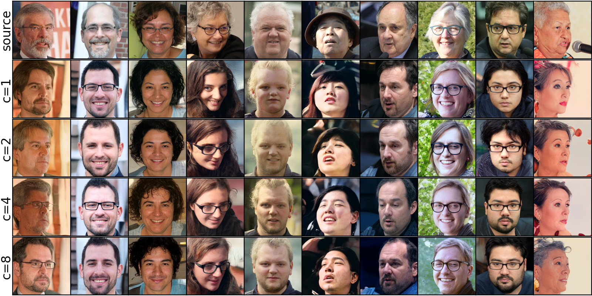 |

  <b>Figure 1.</b> FFHQ old → young translation using (a) static and (b) dynamic subset selection. The dynamic version is evaluated using Euler integration (100 steps).

---

### Young → Old

| (a) Static subset | (b) Dynamic subset (Euler 100 steps) |
|:--:|:--:|
| 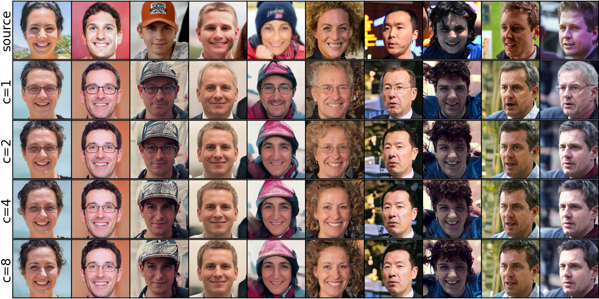 | 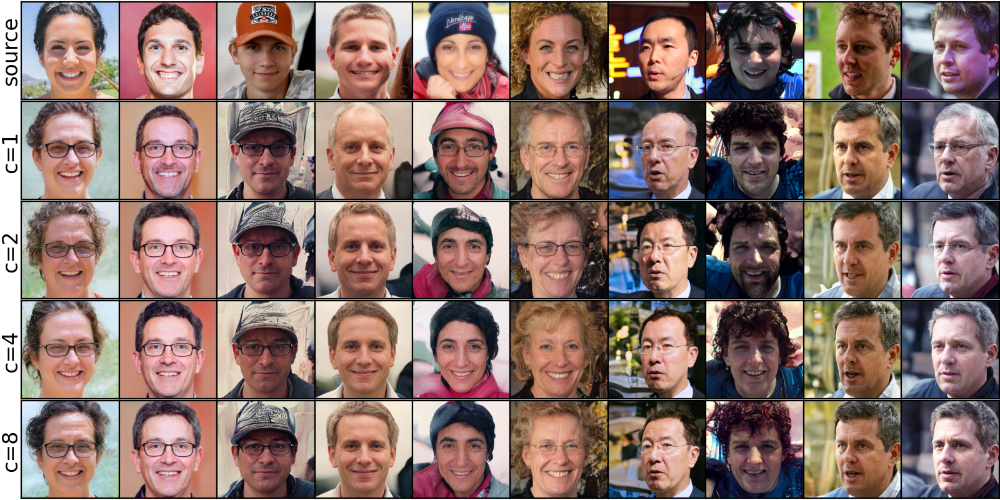 |

  <b>Figure 2.</b> FFHQ young → old translation using (a) static and (b) dynamic subset selection. The dynamic version is evaluated using Euler integration (100 steps).

---

### Woman → Man

| (a) Static subset | (b) Dynamic subset (Euler 100 steps) |
|:--:|:--:|
| 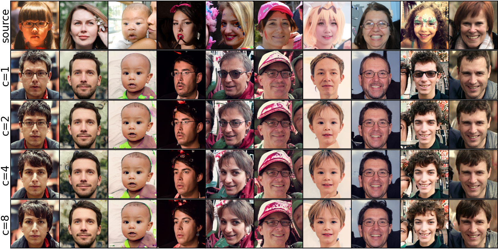 | 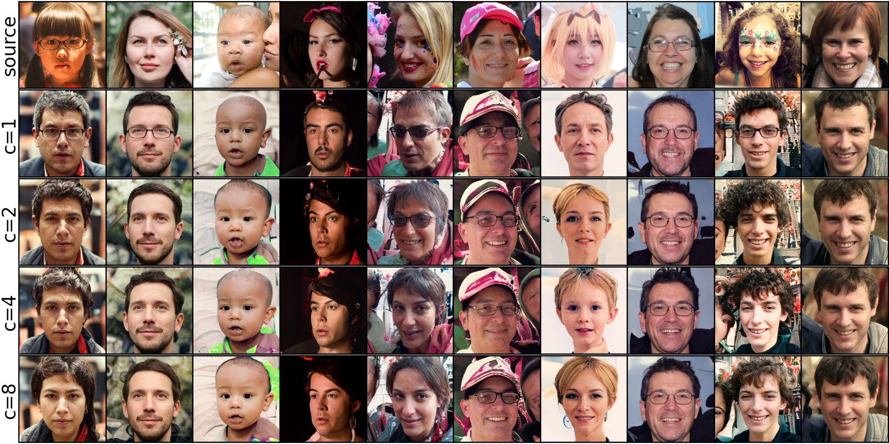 |

  <b>Figure 3.</b> FFHQ woman → man translation using (a) static and (b) dynamic subset selection. The dynamic version is evaluated using Euler integration (100 steps).

---

### Man → Woman

| (a) Static subset | (b) Dynamic subset (Euler 100 steps) |
|:--:|:--:|
| 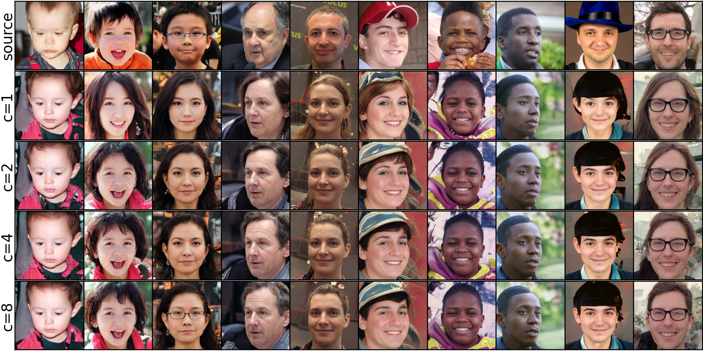 | 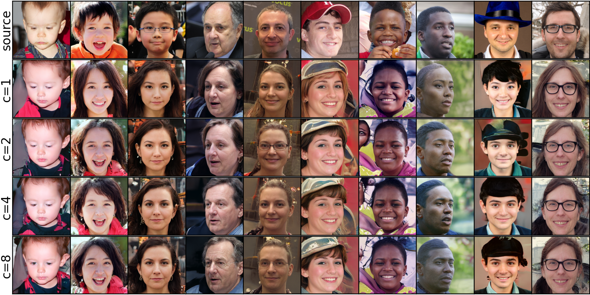 |

  <b>Figure 4.</b> FFHQ man → woman translation using (a) static and (b) dynamic subset selection. The dynamic version is evaluated using Euler integration (100 steps).

